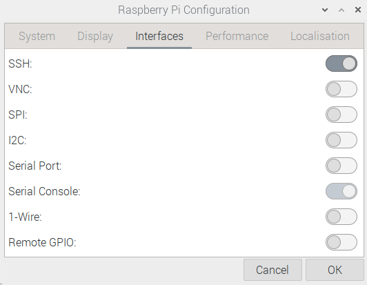
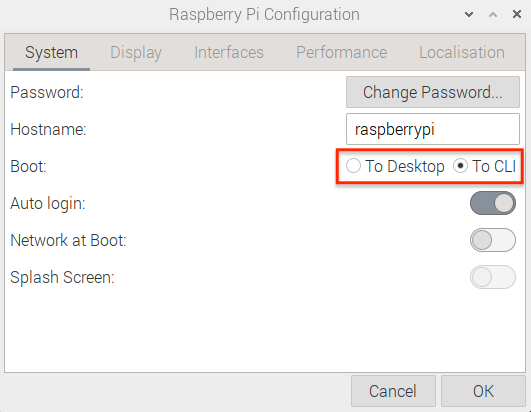

# Basic Setting
<hr/>

### Contents
1. [SSH setting](#ssh-setting)
2. [Text Mode](#text-mode)
3. [Terminal setting](#terminal-setting)
4. [Mirror setting](#mirror-setting)
5. [Install necessary packages](#install-package)
6. [Python Environment](#python-environment)
7. [Screen Saver Off](#screen-saver-off)
8. [Wifi Setting](#wifi-setting)
9. [ETC](#etc)

<hr/>

## SSH Setting
* Go to Preferences &rarr; Raspberry Pi Configuration &rarr; Interfaces

</img>

* Copy SSH public key (`cup_desk_id_rsa`, `cup_desk_id_rsa.pub`)
	* Copy `cup_desk_id_rsa.pub` &rarr; `authorized_keys`
* SSH config setting
	* `cd ~/.ssh; touch config`

	```
	Host ymmon
     Hostname ymmonitor.koreacentral.cloudapp.azure.com
     User cupadmin
     Port 22
     IdentityFile ~/.ssh/cup_desk_id_rsa
	```
* Reverse port-forwarding
	* `ssh -fN -R 12345:localhost:22 ymmon`
	* From `ymmon` : `ssh -p 12345 pi@localhost`

## Text Mode
* Go to Preferences &rarr; Raspberry Pi Configuration &rarr; System

</img>

## Terminal Setting
* Cpoy `bashrc` to `.bashrc`
* `source ~/.bashrc`
* Delete unnecessary term in `.profile`

```
if [ -d "$HOME/.local/bin" ] ; then
    PATH="$HOME/.local/bin:$PATH"
fi
```

## Mirror Setting
* Modify fastest mirror
	* `sudo nano /etc/apt/sources.list`
		* `deb http://ftp.kaist.ac.kr/raspbian/raspbian bullseye main contrib non-free rpi`

## Install Package
* `sudo apt update && sudo apt upgrade`
* `sudo apt autoremove`
* Install emacs
	* `sudo apt install emacs`

## Python Environment
* Working directory : `/opt/monitor`
	* `cd /opt; sudo mkdir monitor; sudo chown pi:pi monitor; cd monitor`
	* `mkdir -p data log out script supervisor/available`
* Python virtual evnironment
	* `python3 -m venv venv`
	* `source venv/bin/activate`
	* `pip install --upgrade pip`
		* `which pip`를 이용하여 `pip`를 위치를 확인
			*  `/opt/monitor/venv/bin/pip`

## Screen Saver Off
* `sudo nano /etc/lightdm/lightdm.conf`
	* modify 
		* `#xserver-command=X` &rarr;
		* `xserver-command=X -s 0 -dpms`
		* Reboot

## Wifi Setting
* Open `/etc/wpa_supplicant/wpa_supplicant.conf` and add

	```
	network={
        ssid="CUP-KT_1"
        psk="cupibs2018!"
        key_mgmt=WPA-PSK
	}
	```

	* Then reboot
	
* (Option) `sudo raspi-config` 
	* `1 System Options` &rarr; `S1 Wireless LAN`
	* Set `SSID` and `PW` &rarr; Reboot
	
## ETC
* In the [files](./files/1_basic_setting),
	* `bashrc` 
		* (move & rename to `~/.bashrc`)
	* `profile`
		* (move & rename to `~/.profile`)
	* `config, cup_desk_id_rsa`, `cup_desk_id_rsa.pub`
		* (move to `~/.ssh/`)
	* `sources.list`
		* (move to `/etc/apt/` with `sudo`)
	* `lightdm.conf`
		* (move to `/etc/lightdm/` with `sudo`)
	* `wpa_supplicant.conf`
		* (move to `/etc/wpa_supplicant/` with `sudo`)
